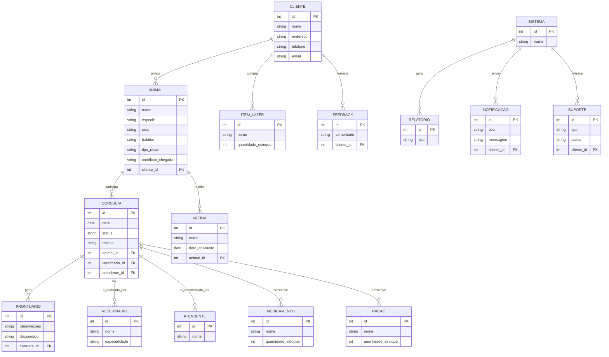
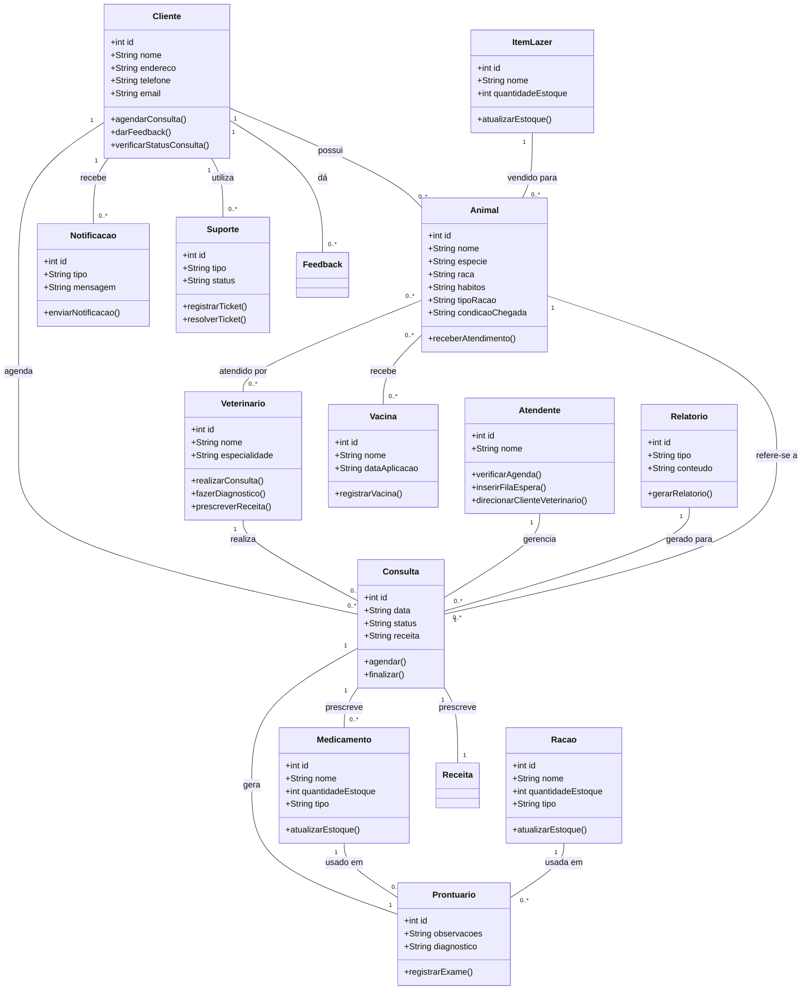

# Icaro_Reis

Pagina da disciplina Engenharia de Software

- [Icaro\_Reis](#icaro_reis)
- [1. Introdução](#1-introdução)
- [2. Descrição do Negócio](#2-descrição-do-negócio)
- [3. Visão geral do sistema](#3-visão-geral-do-sistema)
- [4. Diagrama ER](#4-diagrama-er)
- [5. Diagrama de classe](#5-diagrama-de-classe)
- [6. Casos de uso](#6-casos-de-uso)
  - [6.1 Casos de Uso](#61-casos-de-uso)
  - [6.2. Histórias de usuário](#62-histórias-de-usuário)
    - [Histórias de Usuário](#histórias-de-usuário)
- [7. Diagrama de componentes](#7-diagrama-de-componentes)
- [8. Diagrama de implantação](#8-diagrama-de-implantação)
- [9. Protótipo de telas](#9-protótipo-de-telas)
  - [9.1 Login](#91-login)
  - [9.2 Tela Default - Dashboard](#92-tela-default---dashboard)
  - [9.3 Relatórios de Clientes](#93-relatórios-de-clientes)
  - [9.3 Registro de Clientes](#93-registro-de-clientes)
- [10. Diagrama de navegação de telas](#10-diagrama-de-navegação-de-telas)
- [11. Pilha tecnológica](#11-pilha-tecnológica)
- [12. Requisitos de sistemas](#12-requisitos-de-sistemas)
- [13. Considerações sobre segurança](#13-considerações-sobre-segurança)
- [14. Manutenção e instalação](#14-manutenção-e-instalação)
- [15. Glossário](#15-glossário)
- [16 Script SQL](#16-script-sql)
  - [16.1. Comando CREATE table:](#161-comando-create-table)
  - [16.2. Comandos INSERT gerando dados fictícios](#162-comandos-insert-gerando-dados-fictícios)

# 1. Introdução

O projeto a seguir apresenta um sistema desenvolvido para uma pethop. A empresa é considerada micro e iniciou as atividades recentemente. Ao possuir serviços exclusivos, os sitemas presentes no mercado não se enquadra, desta forma, os proprietários decidiram desenvolver uma solução própria. Esta solução é detalhada a seguir:

# 2. Descrição do Negócio

Descrição do cenário onde o sistema deverá funcionar.

1. Uma clínica veterinária atende apenas os animais: gatos e cachorros.

2. Os clientes devem fazer um cadastro de si e dos animais.

3. Os clientes devem informar as condições nas quais os animais chegam.

4. Os clientes devem informar o tipo de ração que o animal come

5. O cliente deve informar hábitos do animal.

6. Para cada animal é possível que mais de um veterinário o atenda.

7. Os animais podem chegar e serem atendidos de acordo com uma agenda do dia.

8. Cada animal atendido receberá uma ficha e um prontuário.

9. Outros dono podem querer marcar horários de atendimento futuro.

10. O atendimento gera uma receita para o animal.

11. Quando um cliente chega na clínica veterinária ele é atendido por um atendente.

12. O atendente deve verificar se existe agenda disponível com um veterinário.

13. O atendente deve colocar o cliente e seu animal na fila de espera, se for o caso.

14. O atendente deve levar o cliente e o animal até o veterinário.

15. O veterinário deve realizar uma entrevista com o dono do animal.

16. O resultado da entrevista deve ir para um formulário.

17. O veterinário deverá examinar o animal e anotar em prontuário(ficha) suas observações.

18. Dependendo da situação do animal este receberá uma receita.

19. A clínica vende alguns medicamentos genéricos.

20. A clínica vende rações de tratamento.

21. O cliente deverá ser avisado a cada passo do procedimento que seu animal esteja fazendo.

22. A clínica vende itens de lazer animal.

23. Permitir que os clientes agendem consultas e acompanhem o status do atendimento online.

24. Enviar lembretes de consultas e atualizações sobre o status do atendimento via SMS ou email.

25. O sistema deve manter um histórico detalhado de todos os atendimentos realizados para cada animal, incluindo diagnósticos, tratamentos e medicamentos prescritos.

26. O sistema deve gerar relatórios gerenciais para auxiliar na tomada de decisões, como relatórios de atendimentos, vendas de produtos e serviços, e controle de estoque.

27. O sistema deve permitir o controle de estoque de medicamentos, rações e outros produtos vendidos na clínica, alertando quando os níveis estiverem baixos.

28. O sistema deve permitir que os clientes deixem feedback sobre os serviços prestados, ajudando a melhorar a qualidade do atendimento.

29. O sistema deve oferecer um canal de suporte ao cliente, como um chat online ou um sistema de tickets, para resolver dúvidas e problemas de forma eficiente.

30. O sistema deve permitir o registro das vacinas que cada animal recebeu, com datas e tipos de vacina.

# 3. Visão geral do sistema

Descrição do sistema e suas relações.

# 4. Diagrama ER



# 5. Diagrama de classe



# 6. Casos de uso

## 6.1 Casos de Uso


## 6.2. Histórias de usuário

### Histórias de Usuário

1. **Cadastro de Clientes e Animais**
   - Como cliente, eu quero cadastrar meus dados pessoais e os dados dos meus animais (gato ou cachorro) para que eu possa agendar atendimentos e acessar os serviços da clínica.

2. **Informar Condições do Animal**
   - Como cliente, eu quero informar as condições de saúde nas quais meu animal chega à clínica para que o veterinário tenha informações precisas sobre o estado atual do animal.

3. **Informar Tipo de Ração**
   - Como cliente, eu quero informar o tipo de ração que meu animal come para que a clínica possa ajustar os cuidados de acordo com a alimentação dele.

4. **Informar Hábitos do Animal**
   - Como cliente, eu quero informar os hábitos do meu animal para que o veterinário tenha uma visão completa do comportamento e das rotinas dele.

5. **Atendimento por Vários Veterinários**
   - Como veterinário, eu quero que cada animal possa ser atendido por mais de um veterinário, garantindo a continuidade e qualidade dos cuidados.

6. **Agendamento por Agenda do Dia**
   - Como cliente, eu quero que meu animal seja atendido de acordo com a agenda disponível do dia, garantindo uma consulta eficiente.

7. **Ficha e Prontuário do Animal**
   - Como sistema, eu devo gerar uma ficha e um prontuário para cada animal atendido, permitindo que o veterinário registre todas as observações e diagnósticos.

8. **Marcar Horários Futuros**
   - Como cliente, eu quero marcar horários de atendimento futuro para garantir que o meu animal tenha uma consulta agendada previamente.

9. **Receita para o Animal**
   - Como veterinário, eu quero emitir uma receita para o animal, caso necessário, para que o dono possa adquirir medicamentos adequados.

10. **Atendimento por Atendente**
    - Como cliente, eu quero ser atendido por um atendente assim que chego à clínica para ser direcionado ao próximo passo do atendimento.

11. **Verificar Disponibilidade na Agenda**
    - Como atendente, eu quero verificar a disponibilidade de veterinários na agenda para agendar ou direcionar consultas de forma eficiente.

12. **Fila de Espera**
    - Como atendente, eu quero colocar o cliente e seu animal na fila de espera caso não haja veterinário disponível no momento, garantindo o atendimento em ordem.

13. **Levar Cliente ao Veterinário**
    - Como atendente, eu quero levar o cliente e seu animal até o veterinário, facilitando o processo de atendimento.

14. **Entrevista com o Cliente**
    - Como veterinário, eu quero realizar uma entrevista com o dono do animal para obter informações detalhadas sobre o estado e comportamento do animal.

15. **Formulário de Entrevista**
    - Como sistema, eu quero registrar as informações da entrevista em um formulário, facilitando o armazenamento e análise dos dados pelo veterinário.

16. **Exame e Prontuário**
    - Como veterinário, eu quero examinar o animal e anotar minhas observações no prontuário, garantindo que todas as informações estejam documentadas.

17. **Receita do Animal**
    - Como veterinário, eu quero prescrever uma receita para o animal, quando necessário, para indicar o tratamento adequado.

18. **Venda de Medicamentos Genéricos**
    - Como cliente, eu quero poder comprar medicamentos genéricos na clínica para facilitar o tratamento do meu animal.

19. **Venda de Rações de Tratamento**
    - Como cliente, eu quero poder comprar rações de tratamento na clínica para atender às necessidades alimentares especiais do meu animal.

20. **Aviso ao Cliente sobre o Procedimento**
    - Como cliente, eu quero ser avisado a cada passo do procedimento que meu animal esteja fazendo, para acompanhar o progresso e entender o que está acontecendo.

21. **Venda de Itens de Lazer**
    - Como cliente, eu quero poder comprar itens de lazer para o meu animal na clínica, como brinquedos e acessórios.

22. **Agendamento de Consultas e Acompanhamento Online**
    - Como cliente, eu quero poder agendar consultas e acompanhar o status do atendimento online para maior conveniência e controle.

23. **Lembretes de Consultas via SMS/Email**
    - Como cliente, eu quero receber lembretes de consultas e atualizações sobre o status do atendimento via SMS ou email para não perder compromissos importantes.

24. **Histórico Detalhado de Atendimentos**
    - Como sistema, eu quero manter um histórico detalhado de todos os atendimentos realizados para cada animal, incluindo diagnósticos, tratamentos e medicamentos prescritos, para referência futura.

25. **Relatórios Gerenciais**
    - Como administrador da clínica, eu quero gerar relatórios gerenciais de atendimentos, vendas e controle de estoque para tomar decisões estratégicas com base em dados precisos.

26. **Controle de Estoque**
    - Como sistema, eu quero controlar o estoque de medicamentos, rações e outros produtos vendidos na clínica, alertando quando os níveis estiverem baixos, para evitar falta de produtos.

27. **Feedback dos Clientes**
    - Como cliente, eu quero deixar feedback sobre os serviços prestados, ajudando a clínica a melhorar a qualidade do atendimento.

28. **Suporte ao Cliente**
    - Como cliente, eu quero acessar um canal de suporte, como chat online ou sistema de tickets, para resolver dúvidas e problemas de forma eficiente.

29. **Registro de Vacinas**
    - Como sistema, eu quero registrar as vacinas que cada animal recebeu, com datas e tipos de vacina, para manter o histórico de vacinação atualizado.


# 7. Diagrama de componentes

# 8. Diagrama de implantação

# 9. Protótipo de telas

## 9.1 Login


## 9.2 Tela Default - Dashboard


## 9.3 Relatórios de Clientes


## 9.3 Registro de Clientes


# 10. Diagrama de navegação de telas

# 11. Pilha tecnológica

# 12. Requisitos de sistemas

# 13. Considerações sobre segurança

# 14. Manutenção e instalação

# 15. Glossário

# 16 Script SQL

## 16.1. Comando CREATE table:

```SQL

-- Tabela de Clientes
CREATE TABLE Cliente (
    id INT AUTO_INCREMENT PRIMARY KEY,
    nome VARCHAR(100) NOT NULL,
    endereco VARCHAR(255),
    telefone VARCHAR(20),
    email VARCHAR(100)
);

-- Tabela de Animais (apenas gatos e cachorros)
CREATE TABLE Animal (
    id INT AUTO_INCREMENT PRIMARY KEY,
    nome VARCHAR(100) NOT NULL,
    especie ENUM('gato', 'cachorro') NOT NULL,
    raca VARCHAR(50),
    habitos TEXT,
    tipo_racao VARCHAR(100),
    condicao_chegada TEXT,
    cliente_id INT,
    FOREIGN KEY (cliente_id) REFERENCES Cliente(id)
);

-- Tabela de Veterinários
CREATE TABLE Veterinario (
    id INT AUTO_INCREMENT PRIMARY KEY,
    nome VARCHAR(100) NOT NULL,
    especialidade VARCHAR(100)
);

-- Tabela de Atendentes
CREATE TABLE Atendente (
    id INT AUTO_INCREMENT PRIMARY KEY,
    nome VARCHAR(100) NOT NULL
);

-- Tabela de Consultas
CREATE TABLE Consulta (
    id INT AUTO_INCREMENT PRIMARY KEY,
    data DATETIME NOT NULL,
    status VARCHAR(50),
    receita TEXT,
    animal_id INT,
    veterinario_id INT,
    atendente_id INT,
    FOREIGN KEY (animal_id) REFERENCES Animal(id),
    FOREIGN KEY (veterinario_id) REFERENCES Veterinario(id),
    FOREIGN KEY (atendente_id) REFERENCES Atendente(id)
);

-- Tabela de Prontuários
CREATE TABLE Prontuario (
    id INT AUTO_INCREMENT PRIMARY KEY,
    observacoes TEXT,
    diagnostico TEXT,
    consulta_id INT,
    FOREIGN KEY (consulta_id) REFERENCES Consulta(id)
);

-- Tabela de Medicamentos
CREATE TABLE Medicamento (
    id INT AUTO_INCREMENT PRIMARY KEY,
    nome VARCHAR(100) NOT NULL,
    quantidade_estoque INT DEFAULT 0
);

-- Tabela de Rações
CREATE TABLE Racao (
    id INT AUTO_INCREMENT PRIMARY KEY,
    nome VARCHAR(100) NOT NULL,
    quantidade_estoque INT DEFAULT 0
);

-- Tabela de Itens de Lazer
CREATE TABLE ItemLazer (
    id INT AUTO_INCREMENT PRIMARY KEY,
    nome VARCHAR(100) NOT NULL,
    quantidade_estoque INT DEFAULT 0
);

-- Tabela de Vacinas
CREATE TABLE Vacina (
    id INT AUTO_INCREMENT PRIMARY KEY,
    nome VARCHAR(100) NOT NULL,
    data_aplicacao DATE,
    animal_id INT,
    FOREIGN KEY (animal_id) REFERENCES Animal(id)
);

-- Tabela de Feedbacks
CREATE TABLE Feedback (
    id INT AUTO_INCREMENT PRIMARY KEY,
    comentario TEXT,
    cliente_id INT,
    FOREIGN KEY (cliente_id) REFERENCES Cliente(id)
);

-- Tabela de Relatórios
CREATE TABLE Relatorio (
    id INT AUTO_INCREMENT PRIMARY KEY,
    tipo VARCHAR(50),
    conteudo TEXT
);

-- Tabela de Notificações
CREATE TABLE Notificacao (
    id INT AUTO_INCREMENT PRIMARY KEY,
    tipo VARCHAR(50),
    mensagem TEXT,
    cliente_id INT,
    FOREIGN KEY (cliente_id) REFERENCES Cliente(id)
);

-- Tabela de Suporte (para chat ou tickets)
CREATE TABLE Suporte (
    id INT AUTO_INCREMENT PRIMARY KEY,
    tipo VARCHAR(50),
    status VARCHAR(50),
    cliente_id INT,
    FOREIGN KEY (cliente_id) REFERENCES Cliente(id)
);

-- Tabela para associar Veterinários e Animais (mais de um veterinário pode atender o mesmo animal)
CREATE TABLE VeterinarioAnimal (
    veterinario_id INT,
    animal_id INT,
    PRIMARY KEY (veterinario_id, animal_id),
    FOREIGN KEY (veterinario_id) REFERENCES Veterinario(id),
    FOREIGN KEY (animal_id) REFERENCES Animal(id)
);

```

## 16.2. Comandos INSERT gerando dados fictícios

```SQL

-- Inserindo dados fictícios na tabela Cliente
INSERT INTO Cliente (nome, endereco, telefone, email) VALUES
('João Silva', 'Rua das Flores, 123', '(11) 91234-5678', 'joao.silva@gmail.com'),
('Maria Souza', 'Av. Brasil, 456', '(21) 98765-4321', 'maria.souza@hotmail.com'),
('Carlos Almeida', 'Rua dos Pinheiros, 789', '(31) 99876-5432', 'carlos.almeida@outlook.com');

-- Inserindo dados fictícios na tabela Animal
INSERT INTO Animal (nome, especie, raca, habitos, tipo_racao, condicao_chegada, cliente_id) VALUES
('Rex', 'cachorro', 'Labrador', 'Brincalhão, gosta de correr', 'Ração Premium', 'Mancando da perna direita', 1),
('Mia', 'gato', 'Siamês', 'Gosta de dormir', 'Ração Seca', 'Com tosse e espirros', 2),
('Toby', 'cachorro', 'Bulldog', 'Preguiçoso, gosta de comer', 'Ração Hipercalórica', 'Letárgico e com febre', 3);

-- Inserindo dados fictícios na tabela Veterinario
INSERT INTO Veterinario (nome, especialidade) VALUES
('Dr. Paulo Fernandes', 'Ortopedia'),
('Dra. Ana Costa', 'Dermatologia'),
('Dr. Lucas Martins', 'Clínico Geral');

-- Inserindo dados fictícios na tabela Atendente
INSERT INTO Atendente (nome) VALUES
('Carla Ribeiro'),
('Fernando Gomes'),
('Mariana Dias');

-- Inserindo dados fictícios na tabela Consulta
INSERT INTO Consulta (data, status, receita, animal_id, veterinario_id, atendente_id) VALUES
('2024-09-15 09:00:00', 'Concluída', 'Antibiótico por 7 dias', 1, 1, 1),
('2024-09-15 10:30:00', 'Em andamento', NULL, 2, 2, 2),
('2024-09-15 11:00:00', 'Concluída', 'Suplemento vitamínico', 3, 3, 3);

-- Inserindo dados fictícios na tabela Prontuario
INSERT INTO Prontuario (observacoes, diagnostico, consulta_id) VALUES
('Animal com inflamação na pata direita', 'Tendinite', 1),
('Animal com lesões de pele', 'Dermatite alérgica', 2),
('Animal com febre e perda de apetite', 'Infecção viral', 3);

-- Inserindo dados fictícios na tabela Medicamento
INSERT INTO Medicamento (nome, quantidade_estoque) VALUES
('Antibiótico', 50),
('Anti-inflamatório', 30),
('Suplemento vitamínico', 20);

-- Inserindo dados fictícios na tabela Racao
INSERT INTO Racao (nome, quantidade_estoque) VALUES
('Ração Premium', 100),
('Ração Hipercalórica', 50),
('Ração Seca', 150);

-- Inserindo dados fictícios na tabela ItemLazer
INSERT INTO ItemLazer (nome, quantidade_estoque) VALUES
('Bola de borracha', 30),
('Arranhador para gatos', 15),
('Cama para cachorro', 20);

-- Inserindo dados fictícios na tabela Vacina
INSERT INTO Vacina (nome, data_aplicacao, animal_id) VALUES
('Vacina Antirrábica', '2024-01-15', 1),
('Vacina V4', '2024-02-20', 2),
('Vacina Polivalente', '2024-03-05', 3);

-- Inserindo dados fictícios na tabela Feedback
INSERT INTO Feedback (comentario, cliente_id) VALUES
('Atendimento excelente e rápido!', 1),
('Veterinária muito atenciosa e esclareceu todas as dúvidas.', 2),
('Gostei muito do atendimento e do cuidado com o meu animal.', 3);

-- Inserindo dados fictícios na tabela Relatorio
INSERT INTO Relatorio (tipo, conteudo) VALUES
('Relatório de Consultas Diárias', 'Número total de consultas realizadas: 3'),
('Relatório de Vendas de Produtos', 'Número total de produtos vendidos: 5');

-- Inserindo dados fictícios na tabela Notificacao
INSERT INTO Notificacao (tipo, mensagem, cliente_id) VALUES
('Lembrete de Consulta', 'Sua consulta está agendada para 15/09/2024 às 10:30.', 2),
('Atualização de Status', 'Consulta concluída para seu animal Rex.', 1);

-- Inserindo dados fictícios na tabela Suporte
INSERT INTO Suporte (tipo, status, cliente_id) VALUES
('Chat Online', 'Resolvido', 1),
('Ticket de Atendimento', 'Em aberto', 2),
('Ticket de Atendimento', 'Resolvido', 3);

-- Inserindo dados fictícios na tabela VeterinarioAnimal
INSERT INTO VeterinarioAnimal (veterinario_id, animal_id) VALUES
(1, 1),
(2, 2),
(3, 3);
animal

```