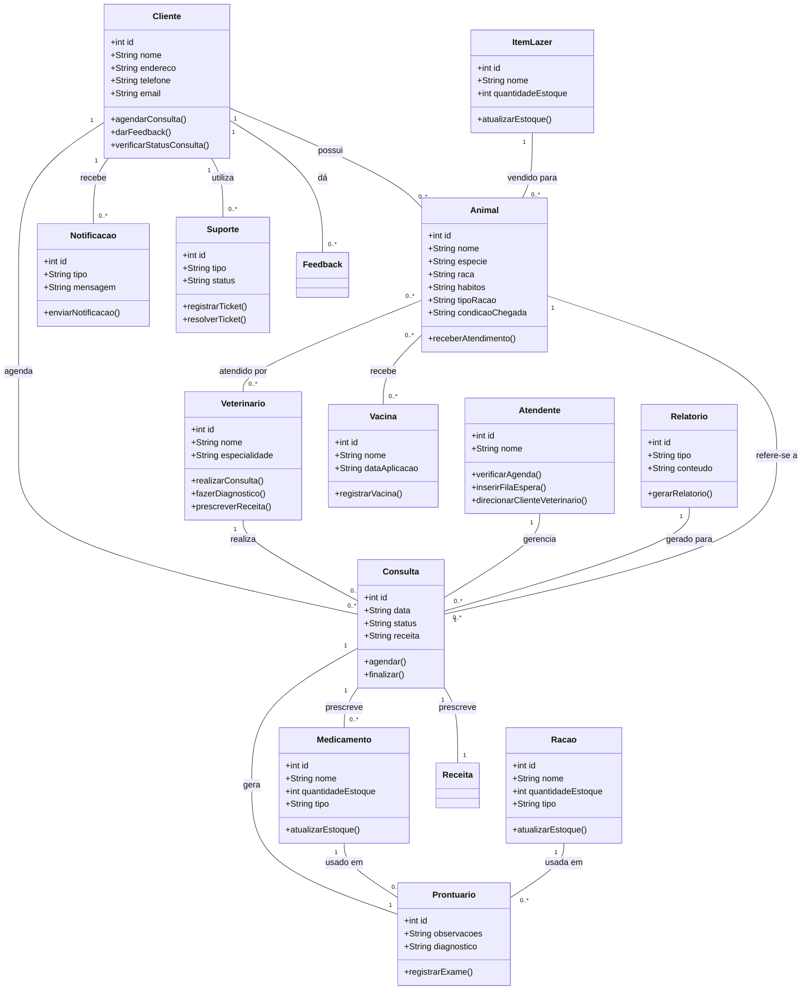
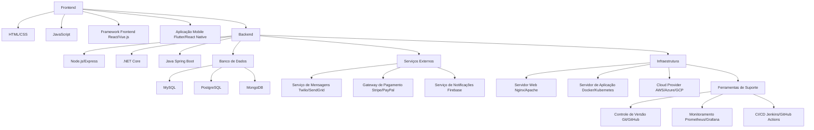

# Icaro_Reis

Pagina da disciplina Engenharia de Software

- [Icaro\_Reis](#icaro_reis)
- [1. Introdução](#1-introdução)
- [2. Descrição do Negócio](#2-descrição-do-negócio)
- [3. Visão Geral do Sistema](#3-visão-geral-do-sistema)
- [4. Diagrama ER](#4-diagrama-er)
  - [4.1 Descrição das Entidades e Relacionamentos](#41-descrição-das-entidades-e-relacionamentos)
  - [4.2 Relacionamentos](#42-relacionamentos)
- [5. Diagrama de classe](#5-diagrama-de-classe)
  - [5.1 Descrição das Classes e Relacionamentos](#51-descrição-das-classes-e-relacionamentos)
  - [5.2 Relacionamentos](#52-relacionamentos)
- [6. Casos de uso](#6-casos-de-uso)
  - [6.1 Casos de Uso](#61-casos-de-uso)
  - [6.2 Histórias de Usuário](#62-histórias-de-usuário)
    - [6.2.1 Cadastro de Clientes e Animais](#621-cadastro-de-clientes-e-animais)
    - [6.2.2 Informar Condições do Animal](#622-informar-condições-do-animal)
    - [6.2.3 Informar Tipo de Ração](#623-informar-tipo-de-ração)
    - [6.2.4 Informar Hábitos do Animal](#624-informar-hábitos-do-animal)
    - [6.2.5 Atendimento por Vários Veterinários](#625-atendimento-por-vários-veterinários)
    - [6.2.6 Agendamento por Agenda do Dia](#626-agendamento-por-agenda-do-dia)
    - [6.2.7 Ficha e Prontuário do Animal](#627-ficha-e-prontuário-do-animal)
    - [6.2.8 Marcar Horários Futuros](#628-marcar-horários-futuros)
    - [6.2.9 Receita para o Animal](#629-receita-para-o-animal)
    - [6.2.10 Atendimento por Atendente](#6210-atendimento-por-atendente)
    - [6.2.11 Verificar Disponibilidade na Agenda](#6211-verificar-disponibilidade-na-agenda)
    - [6.2.12 Fila de Espera](#6212-fila-de-espera)
    - [6.2.13 Levar Cliente ao Veterinário](#6213-levar-cliente-ao-veterinário)
    - [6.2.14 Entrevista com o Cliente](#6214-entrevista-com-o-cliente)
    - [6.2.15 Formulário de Entrevista](#6215-formulário-de-entrevista)
    - [6.2.16 Exame e Prontuário](#6216-exame-e-prontuário)
    - [6.2.17 Receita do Animal](#6217-receita-do-animal)
    - [6.2.18 Venda de Medicamentos Genéricos](#6218-venda-de-medicamentos-genéricos)
    - [6.2.19 Venda de Rações de Tratamento](#6219-venda-de-rações-de-tratamento)
    - [6.2.20 Aviso ao Cliente sobre o Procedimento](#6220-aviso-ao-cliente-sobre-o-procedimento)
    - [6.2.21 Venda de Itens de Lazer](#6221-venda-de-itens-de-lazer)
    - [6.2.22 Agendamento de Consultas e Acompanhamento Online](#6222-agendamento-de-consultas-e-acompanhamento-online)
    - [6.2.23 Lembretes de Consultas via SMS/Email](#6223-lembretes-de-consultas-via-smsemail)
    - [6.2.24 Histórico Detalhado de Atendimentos](#6224-histórico-detalhado-de-atendimentos)
    - [6.2.25 Relatórios Gerenciais](#6225-relatórios-gerenciais)
    - [6.2.26 Controle de Estoque](#6226-controle-de-estoque)
- [7. Diagrama de componentes](#7-diagrama-de-componentes)
- [8. Diagrama de implantação](#8-diagrama-de-implantação)
- [9. Protótipo de telas](#9-protótipo-de-telas)
  - [9.1 Login](#91-login)
  - [9.2 Tela Default - Dashboard](#92-tela-default---dashboard)
  - [9.3 Relatório de Clientes](#93-relatório-de-clientes)
    - [9.3.1 Registro de Clientes](#931-registro-de-clientes)
  - [9.4 Relatório de Atendente](#94-relatório-de-atendente)
    - [9.4.1 Registro de Atendente](#941-registro-de-atendente)
  - [9.5 Relatório de Animais](#95-relatório-de-animais)
    - [9.5.1 Registro de Animais](#951-registro-de-animais)
  - [9.6 Relatório de Item Lazer](#96-relatório-de-item-lazer)
    - [9.6.1 Registro de Item Lazer](#961-registro-de-item-lazer)
  - [9.7 Relatório de Ração](#97-relatório-de-ração)
    - [9.7.1 Registro de Ração](#971-registro-de-ração)
  - [9.8 Relatório de Consultas](#98-relatório-de-consultas)
    - [9.8.1 Registro de Consultas](#981-registro-de-consultas)
  - [9.9 Relatório de Feedbacks](#99-relatório-de-feedbacks)
    - [9.9.1 Registro de Feedbacks](#991-registro-de-feedbacks)
  - [9.10 Relatório de Medicamentos](#910-relatório-de-medicamentos)
    - [9.10.1 Registro de Medicamentos](#9101-registro-de-medicamentos)
  - [9.11 Relatório de Notificações](#911-relatório-de-notificações)
    - [9.11.1 Registro de Notificações](#9111-registro-de-notificações)
  - [9.12 Relatório de Prontuários](#912-relatório-de-prontuários)
    - [9.12.1 Registro de Prontuários](#9121-registro-de-prontuários)
  - [9.13 Relatório de Vacinas](#913-relatório-de-vacinas)
    - [9.13.1 Registro de Vacinas](#9131-registro-de-vacinas)
  - [9.14 Gráficos](#914-gráficos)
    - [9.14.1 Gráfico Saldo dos Clientes](#9141-gráfico-saldo-dos-clientes)
    - [9.14.2 Gráfico Tipos de Ração Consumidas](#9142-gráfico-tipos-de-ração-consumidas)
  - [9.15 Dashboard - Acesso via Menu](#915-dashboard---acesso-via-menu)
  - [9.16 Alterar Senha](#916-alterar-senha)
  - [9.17 Usuários](#917-usuários)
  - [9.18 Configurações](#918-configurações)
  - [9.19 Autenticação](#919-autenticação)
  - [9.20 Sair do Sistema (Retorna para a tela de Login)](#920-sair-do-sistema-retorna-para-a-tela-de-login)
- [10. Diagrama de navegação de telas](#10-diagrama-de-navegação-de-telas)
- [11. Pilha tecnológica](#11-pilha-tecnológica)
- [12. Requisitos de sistemas](#12-requisitos-de-sistemas)
  - [12.1. Requisitos do Lado Cliente](#121-requisitos-do-lado-cliente)
  - [12.2. Requisitos do Lado Servidor](#122-requisitos-do-lado-servidor)
- [13. Considerações sobre segurança](#13-considerações-sobre-segurança)
  - [13.1 Lado Cliente](#131-lado-cliente)
  - [13.2 Lado Servidor](#132-lado-servidor)
- [14. Manutenção, Instalação e Novas Funcionalidades](#14-manutenção-instalação-e-novas-funcionalidades)
  - [14.1 Instalação no Servidor](#141-instalação-no-servidor)
  - [14.2 Manutenção](#142-manutenção)
  - [14.3 Novas Funcionalidades](#143-novas-funcionalidades)
- [15. Treinamento](#15-treinamento)
  - [15.1 Usuário](#151-usuário)
  - [15.2 Admin](#152-admin)
- [16 Script SQL](#16-script-sql)
  - [16.1. Comando CREATE table:](#161-comando-create-table)
  - [16.2. Comandos INSERT gerando dados fictícios](#162-comandos-insert-gerando-dados-fictícios)

# 1. Introdução

O projeto a seguir apresenta um sistema desenvolvido para uma pethop. A empresa é considerada micro e iniciou as atividades recentemente. Ao possuir serviços exclusivos, os sitemas presentes no mercado não se enquadra, desta forma, os proprietários decidiram desenvolver uma solução própria. Esta solução é detalhada a seguir:

# 2. Descrição do Negócio

Descrição do cenário onde o sistema deverá funcionar.

1. Uma clínica veterinária atende apenas os animais: gatos e cachorros.

2. Os clientes devem fazer um cadastro de si e dos animais.

3. Os clientes devem informar as condições nas quais os animais chegam.

4. Os clientes devem informar o tipo de ração que o animal come

5. O cliente deve informar hábitos do animal.

6. Para cada animal é possível que mais de um veterinário o atenda.

7. Os animais podem chegar e serem atendidos de acordo com uma agenda do dia.

8. Cada animal atendido receberá uma ficha e um prontuário.

9. Outros dono podem querer marcar horários de atendimento futuro.

10. O atendimento gera uma receita para o animal.

11. Quando um cliente chega na clínica veterinária ele é atendido por um atendente.

12. O atendente deve verificar se existe agenda disponível com um veterinário.

13. O atendente deve colocar o cliente e seu animal na fila de espera, se for o caso.

14. O atendente deve levar o cliente e o animal até o veterinário.

15. O veterinário deve realizar uma entrevista com o dono do animal.

16. O resultado da entrevista deve ir para um formulário.

17. O veterinário deverá examinar o animal e anotar em prontuário(ficha) suas observações.

18. Dependendo da situação do animal este receberá uma receita.

19. A clínica vende alguns medicamentos genéricos.

20. A clínica vende rações de tratamento.

21. O cliente deverá ser avisado a cada passo do procedimento que seu animal esteja fazendo.

22. A clínica vende itens de lazer animal.

23. Permitir que os clientes agendem consultas e acompanhem o status do atendimento online.

24. Enviar lembretes de consultas e atualizações sobre o status do atendimento via SMS ou email.

25. O sistema deve manter um histórico detalhado de todos os atendimentos realizados para cada animal, incluindo diagnósticos, tratamentos e medicamentos prescritos.

26. O sistema deve gerar relatórios gerenciais para auxiliar na tomada de decisões, como relatórios de atendimentos, vendas de produtos e serviços, e controle de estoque.

27. O sistema deve permitir o controle de estoque de medicamentos, rações e outros produtos vendidos na clínica, alertando quando os níveis estiverem baixos.

28. O sistema deve permitir que os clientes deixem feedback sobre os serviços prestados, ajudando a melhorar a qualidade do atendimento.

29. O sistema deve oferecer um canal de suporte ao cliente, como um chat online ou um sistema de tickets, para resolver dúvidas e problemas de forma eficiente.

30. O sistema deve permitir o registro das vacinas que cada animal recebeu, com datas e tipos de vacina.

# 3. Visão Geral do Sistema

O sistema foi desenvolvido para otimizar a gestão de uma clínica veterinária que atende gatos e cachorros, oferecendo uma interface de login para os funcionários. Ele permite o gerenciamento completo dos registros de atendimento, cadastro de animais e clientes, e controle de estoque de produtos. As principais funcionalidades incluem:

- Cadastro, consulta, edição e exclusão de informações sobre os animais, seus donos e os serviços prestados.
- Controle de estoque de medicamentos e produtos, com alertas para reposição.
- Agendamento e acompanhamento de consultas, com notificações automáticas para os clientes.
- Geração de relatórios e gráficos detalhados para análise de dados e suporte à tomada de decisões.

O sistema foi projetado para garantir um fluxo de trabalho organizado e eficiente, proporcionando uma gestão centralizada e prática para os funcionários da clínica.

# 4. Diagrama ER


## 4.1 Descrição das Entidades e Relacionamentos

- **CLIENTE**: Contém informações sobre os clientes da clínica.
- **ANIMAL**: Contém informações sobre os animais que pertencem aos clientes, incluindo hábitos, tipo de ração e condição de chegada.
- **VETERINARIO**: Contém informações sobre os veterinários, incluindo suas especialidades.
- **ATENDENTE**: Contém informações sobre os atendentes que realizam o atendimento aos clientes.
- **CONSULTA**: Registra as consultas realizadas para os animais, incluindo data, status e receita.
- **PRONTUARIO**: Contém observações e diagnósticos feitos pelo veterinário durante a consulta.
- **MEDICAMENTO**: Contém informações sobre os medicamentos disponíveis na clínica, incluindo nome e quantidade em estoque.
- **RACAO**: Contém informações sobre as rações disponíveis, incluindo nome e quantidade em estoque.
- **VACINA**: Contém informações sobre as vacinas administradas aos animais, incluindo nome e data de aplicação.
- **FEEDBACK**: Registra os comentários e sugestões dos clientes sobre os serviços prestados.
- **NOTIFICACAO**: Contém informações sobre notificações enviadas aos clientes, como lembretes de consultas.
- **SUPORTE**: Registra informações sobre os pedidos de suporte dos clientes.

## 4.2 Relacionamentos

- **CLIENTE** pode ter vários **ANIMALs**.
- **ANIMAL** pode participar de várias **CONSULTAs**.
- **VETERINARIO** pode realizar várias **CONSULTAs**.
- **ATENDENTE** pode intermediar várias **CONSULTAs**.
- **CONSULTA** pode gerar um **PRONTUARIO**.
- **ANIMAL** pode receber várias **VACINAs**.
- **CLIENTE** pode fornecer vários **FEEDBACKs**.
- **CLIENTE** pode receber várias **NOTIFICACAO**s.
- **CLIENTE** pode solicitar vários **SUPORTE**s.


# 5. Diagrama de classe



## 5.1 Descrição das Classes e Relacionamentos

- **Cliente**: Contém informações sobre os clientes da clínica, como nome, endereço, telefone e email. Um cliente pode ter vários animais e agendar várias consultas.
  
- **Animal**: Contém informações sobre os animais, incluindo nome, espécie, raça, hábitos, tipo de ração e condição de chegada. Um animal pode receber vários atendimentos e pode ter um prontuário.

- **Veterinario**: Contém informações sobre os veterinários, incluindo nome e especialidade. Um veterinário pode realizar várias consultas.

- **Atendente**: Contém informações sobre os atendentes da clínica, como nome. Um atendente pode gerenciar várias consultas.

- **Consulta**: Registra as consultas realizadas, incluindo data, status e receita. Cada consulta está associada a um animal, um veterinário e pode prescrever vários medicamentos. Uma consulta gera um prontuário.

- **Prontuario**: Contém observações e diagnósticos feitos pelo veterinário durante a consulta. Cada animal pode ter um prontuário.

- **Medicamento**: Contém informações sobre os medicamentos disponíveis na clínica, como nome e quantidade em estoque. Um medicamento pode ser usado em vários prontuários.

- **Racao**: Contém informações sobre as rações disponíveis, como nome e quantidade em estoque. Uma ração pode ser usada em vários prontuários.

- **ItemLazer**: Contém informações sobre itens de lazer disponíveis, incluindo nome e quantidade em estoque. Um item de lazer pode ser vendido para vários animais.

- **Vacina**: Contém informações sobre vacinas administradas aos animais, como nome e data de aplicação. Um animal pode receber várias vacinas.

- **Relatorio**: Contém informações sobre relatórios gerados a partir das consultas. Cada relatório pode ser gerado para várias consultas.

- **Notificacao**: Contém informações sobre notificações enviadas aos clientes, como tipo e mensagem. Um cliente pode receber várias notificações.

- **Suporte**: Contém informações sobre os pedidos de suporte dos clientes, como tipo e status. Um cliente pode utilizar vários suportes.

## 5.2 Relacionamentos

- **Cliente** pode ter vários **Animais**.
- **Cliente** pode agendar várias **Consultas**.
- **Veterinario** pode realizar várias **Consultas**.
- **Consulta** refere-se a um **Animal**.
- **Consulta** gera um **Prontuario**.
- **Consulta** pode prescrever vários **Medicamentos**.
- **Animal** pode ser atendido por vários **Veterinarios**.
- **Atendente** pode gerenciar várias **Consultas**.
- **Animal** pode receber várias **Vacinas**.
- **Medicamento** pode ser usado em vários **Prontuarios**.
- **Racao** pode ser usada em vários **Prontuarios**.
- **ItemLazer** pode ser vendido para vários **Animais**.
- **Cliente** pode dar vários **Feedbacks**.
- **Cliente** pode receber várias **Notificacoes**.
- **Cliente** pode utilizar vários **Suportes**.
- **Relatorio** pode ser gerado para várias **Consultas**.

# 6. Casos de uso

## 6.1 Casos de Uso


## 6.2 Histórias de Usuário

### 6.2.1 Cadastro de Clientes e Animais
**Como** um novo cliente,  
**Quero** cadastrar meus dados pessoais e os dados dos meus animais (gato ou cachorro),  
**Para que** eu possa agendar atendimentos e acessar os serviços da clínica.

**Critérios de Aceitação:**
- O cliente pode inserir seu nome, endereço, telefone e dados dos animais.
- O sistema deve armazenar essas informações e associá-las ao cliente.

### 6.2.2 Informar Condições do Animal
**Como** um cliente,  
**Quero** informar as condições de saúde nas quais meu animal chega à clínica,  
**Para que** o veterinário tenha informações precisas sobre o estado atual do animal.

**Critérios de Aceitação:**
- O cliente pode descrever as condições de saúde do animal.
- Essas informações são registradas no sistema.

### 6.2.3 Informar Tipo de Ração
**Como** um cliente,  
**Quero** informar o tipo de ração que meu animal come,  
**Para que** a clínica possa ajustar os cuidados de acordo com a alimentação dele.

**Critérios de Aceitação:**
- O cliente pode selecionar o tipo de ração.
- O sistema deve registrar essa informação.

### 6.2.4 Informar Hábitos do Animal
**Como** um cliente,  
**Quero** informar os hábitos do meu animal,  
**Para que** o veterinário tenha uma visão completa do comportamento e das rotinas dele.

**Critérios de Aceitação:**
- O cliente pode descrever os hábitos do animal.
- Essas informações são registradas no sistema.

### 6.2.5 Atendimento por Vários Veterinários
**Como** um veterinário,  
**Quero** que cada animal possa ser atendido por mais de um veterinário,  
**Para que** a continuidade e qualidade dos cuidados sejam garantidas.

**Critérios de Aceitação:**
- O sistema permite que múltiplos veterinários atendam o mesmo animal ao longo do tempo.

### 6.2.6 Agendamento por Agenda do Dia
**Como** um cliente,  
**Quero** que meu animal seja atendido de acordo com a agenda disponível do dia,  
**Para que** haja uma consulta eficiente.

**Critérios de Aceitação:**
- O sistema mostra a agenda disponível dos veterinários.
- O cliente pode agendar a consulta com base na disponibilidade.

### 6.2.7 Ficha e Prontuário do Animal
**Como** um sistema,  
**Quero** gerar uma ficha e um prontuário para cada animal atendido,  
**Para que** o veterinário registre todas as observações e diagnósticos.

**Critérios de Aceitação:**
- O sistema cria automaticamente uma ficha e um prontuário ao registrar um atendimento.

### 6.2.8 Marcar Horários Futuros
**Como** um cliente,  
**Quero** marcar horários de atendimento futuros,  
**Para que** meu animal tenha uma consulta agendada previamente.

**Critérios de Aceitação:**
- O cliente pode selecionar uma data e hora para consultas futuras.
- O sistema confirma o agendamento.

### 6.2.9 Receita para o Animal
**Como** um veterinário,  
**Quero** emitir uma receita para o animal,  
**Para que** o dono possa adquirir medicamentos adequados.

**Critérios de Aceitação:**
- O veterinário pode gerar uma receita no sistema.
- O cliente recebe uma cópia da receita.

### 6.2.10 Atendimento por Atendente
**Como** um cliente,  
**Quero** ser atendido por um atendente assim que chego à clínica,  
**Para que** eu seja direcionado ao próximo passo do atendimento.

**Critérios de Aceitação:**
- O atendente deve estar disponível para receber o cliente imediatamente.

### 6.2.11 Verificar Disponibilidade na Agenda
**Como** um atendente,  
**Quero** verificar a disponibilidade de veterinários na agenda,  
**Para que** eu possa agendar ou direcionar consultas de forma eficiente.

**Critérios de Aceitação:**
- O sistema deve exibir a agenda dos veterinários em tempo real.

### 6.2.12 Fila de Espera
**Como** um atendente,  
**Quero** colocar o cliente e seu animal na fila de espera,  
**Para que** o atendimento seja garantido em ordem.

**Critérios de Aceitação:**
- O sistema deve registrar a posição do cliente na fila de espera.

### 6.2.13 Levar Cliente ao Veterinário
**Como** um atendente,  
**Quero** levar o cliente e seu animal até o veterinário,  
**Para que** o processo de atendimento seja facilitado.

**Critérios de Aceitação:**
- O atendente deve acompanhar o cliente até a sala de atendimento.

### 6.2.14 Entrevista com o Cliente
**Como** um veterinário,  
**Quero** realizar uma entrevista com o dono do animal,  
**Para que** eu possa obter informações detalhadas sobre o estado e comportamento do animal.

**Critérios de Aceitação:**
- O veterinário pode fazer perguntas e registrar as respostas no sistema.

### 6.2.15 Formulário de Entrevista
**Como** um sistema,  
**Quero** registrar as informações da entrevista em um formulário,  
**Para que** o armazenamento e análise dos dados pelo veterinário sejam facilitados.

**Critérios de Aceitação:**
- O sistema deve permitir a inserção e armazenamento das informações da entrevista.

### 6.2.16 Exame e Prontuário
**Como** um veterinário,  
**Quero** examinar o animal e anotar minhas observações no prontuário,  
**Para que** todas as informações estejam documentadas.

**Critérios de Aceitação:**
- O veterinário pode adicionar notas e diagnósticos no prontuário do animal.

### 6.2.17 Receita do Animal
**Como** um veterinário,  
**Quero** prescrever uma receita para o animal,  
**Quando** necessário,  
**Para que** o tratamento adequado seja indicado.

**Critérios de Aceitação:**
- O sistema deve permitir a geração de receitas personalizadas para cada animal.

### 6.2.18 Venda de Medicamentos Genéricos
**Como** um cliente,  
**Quero** poder comprar medicamentos genéricos na clínica,  
**Para que** eu facilite o tratamento do meu animal.

**Critérios de Aceitação:**
- O cliente pode visualizar e adquirir medicamentos disponíveis na clínica.

### 6.2.19 Venda de Rações de Tratamento
**Como** um cliente,  
**Quero** poder comprar rações de tratamento na clínica,  
**Para que** atenda às necessidades alimentares especiais do meu animal.

**Critérios de Aceitação:**
- O sistema deve listar as rações de tratamento disponíveis.

### 6.2.20 Aviso ao Cliente sobre o Procedimento
**Como** um cliente,  
**Quero** ser avisado a cada passo do procedimento que meu animal esteja fazendo,  
**Para que** eu possa acompanhar o progresso e entender o que está acontecendo.

**Critérios de Aceitação:**
- O sistema deve enviar atualizações sobre o estado do animal durante o atendimento.

### 6.2.21 Venda de Itens de Lazer
**Como** um cliente,  
**Quero** poder comprar itens de lazer para o meu animal na clínica,  
**Para que** eu possa enriquecer a experiência do meu animal.

**Critérios de Aceitação:**
- O sistema deve exibir uma lista de itens de lazer disponíveis para venda.

### 6.2.22 Agendamento de Consultas e Acompanhamento Online
**Como** um cliente,  
**Quero** poder agendar consultas e acompanhar o status do atendimento online,  
**Para que** tenha maior conveniência e controle.

**Critérios de Aceitação:**
- O cliente pode acessar um portal online para agendar e acompanhar consultas.

### 6.2.23 Lembretes de Consultas via SMS/Email
**Como** um cliente,  
**Quero** receber lembretes de consultas e atualizações sobre o status do atendimento via SMS ou email,  
**Para que** eu não perca compromissos importantes.

**Critérios de Aceitação:**
- O sistema deve enviar lembretes automáticos conforme a data da consulta se aproxima.

### 6.2.24 Histórico Detalhado de Atendimentos
**Como** um sistema,  
**Quero** manter um histórico detalhado de todos os atendimentos realizados para cada animal,  
**Para que** eu possa fornecer referência futura.

**Critérios de Aceitação:**
- O sistema deve armazenar informações de atendimentos passados, incluindo diagnósticos e tratamentos.

### 6.2.25 Relatórios Gerenciais
**Como** um administrador da clínica,  
**Quero** gerar relatórios gerenciais de atendimentos, vendas e controle de estoque,  
**Para que** eu possa tomar decisões estratégicas com base em dados precisos.

**Critérios de Aceitação:**
- O sistema deve permitir a geração de relatórios customizados.

### 6.2.26 Controle de Estoque
**Como** um sistema,  
**Quero** controlar o estoque de medicamentos, rações e outros produtos vendidos na clínica,  
**Para que** eu possa alertar quando os níveis estiverem

# 7. Diagrama de componentes


# 8. Diagrama de implantação


# 9. Protótipo de telas

## 9.1 Login


## 9.2 Tela Default - Dashboard


## 9.3 Relatório de Clientes


### 9.3.1 Registro de Clientes


## 9.4 Relatório de Atendente


### 9.4.1 Registro de Atendente


## 9.5 Relatório de Animais


### 9.5.1 Registro de Animais


## 9.6 Relatório de Item Lazer


### 9.6.1 Registro de Item Lazer


## 9.7 Relatório de Ração


### 9.7.1 Registro de Ração


## 9.8 Relatório de Consultas


### 9.8.1 Registro de Consultas


## 9.9 Relatório de Feedbacks


### 9.9.1 Registro de Feedbacks


## 9.10 Relatório de Medicamentos


### 9.10.1 Registro de Medicamentos


## 9.11 Relatório de Notificações


### 9.11.1 Registro de Notificações


## 9.12 Relatório de Prontuários


### 9.12.1 Registro de Prontuários


## 9.13 Relatório de Vacinas


### 9.13.1 Registro de Vacinas


## 9.14 Gráficos

### 9.14.1 Gráfico Saldo dos Clientes


### 9.14.2 Gráfico Tipos de Ração Consumidas


## 9.15 Dashboard - Acesso via Menu


## 9.16 Alterar Senha


## 9.17 Usuários


## 9.18 Configurações


## 9.19 Autenticação


## 9.20 Sair do Sistema (Retorna para a tela de Login)


# 10. Diagrama de navegação de telas

```mermaid
flowchart TD
    A[Login] --> B[Menu Principal]
    B --> C[Cadastro de Clientes e Animais]
    B --> D[Agendamento de Consultas]
    B --> E[Atendimento]
    B --> F[Histórico de Atendimentos]
    B --> G[Controle de Estoque]
    B --> H[Vendas de Produtos]
    B --> I[Relatórios Gerenciais]
    B --> J[Configurações]
    B --> K[Suporte ao Cliente]

    %% Subnavegação de Cadastro de Clientes e Animais
    C --> C1[Cadastro de Cliente]
    C --> C2[Cadastro de Animal]
    C --> C3[Consulta de Cadastro]

    %% Subnavegação de Agendamento de Consultas
    D --> D1[Marcar Nova Consulta]
    D --> D2[Consulta de Agenda]
    D --> D3[Reagendar Consulta]

    %% Subnavegação de Atendimento
    E --> E1[Fila de Espera]
    E --> E2[Entrevista com o Dono]
    E --> E3[Exame do Animal]
    E --> E4[Emissão de Receita]
    E --> E5[Atualização do Prontuário]

    %% Subnavegação de Controle de Estoque
    G --> G1[Verificar Estoque]
    G --> G2[Adicionar Produtos]
    G --> G3[Alerta de Níveis Baixos]

    %% Subnavegação de Vendas de Produtos
    H --> H1[Venda de Medicamentos]
    H --> H2[Venda de Rações]
    H --> H3[Venda de Itens de Lazer]

    %% Subnavegação de Relatórios Gerenciais
    I --> I1[Relatório de Atendimentos]
    I --> I2[Relatório de Vendas]
    I --> I3[Relatório de Estoque]

    %% Subnavegação de Suporte ao Cliente
    K --> K1[Chat Online]
    K --> K2[Sistema de Tickets]
    K --> K3[Feedback dos Clientes]

```




# 11. Pilha tecnológica



# 12. Requisitos de sistemas

## 12.1. Requisitos do Lado Cliente

- **Hardware**: PC ou dispositivo móvel (celular ou tablet) com acesso à internet.
- **Software**: Navegador atualizado que suporte HTML, CSS e JavaScript (por exemplo, Chrome, Firefox, Safari, Edge) para acesso ao sistema web, ou aplicativo instalado para dispositivos móveis, se disponível.
- **Conectividade**: Conexão estável com a internet para acessar a aplicação e receber atualizações em tempo real.
- **Requisitos Mínimos de Sistema**:
  - Para PCs: Processador de pelo menos 2 GHz, 4 GB de RAM, e resolução de tela de 1366x768 ou superior.
  - Para dispositivos móveis: Sistema operacional Android 8.0 ou superior, iOS 12.0 ou superior, com pelo menos 2 GB de RAM.
- **Navegador**: Deve ser compatível com HTML5, CSS3, e ES6 (versão mais recente do JavaScript), garantindo o suporte a todas as funcionalidades do sistema.

## 12.2. Requisitos do Lado Servidor

- **Infraestrutura**:
  - Uma máquina física ou virtual para hospedar o sistema, configurada para desenvolvimento e produção de aplicações web.
- **Servidores**:
  - Dois servidores distintos:
    - **Servidor de Aplicação**: Responsável por executar a aplicação e gerenciar a lógica de negócios.
    - **Servidor Web**: Responsável por servir páginas web e arquivos estáticos.
- **Banco de Dados**:
  - Sistema de gerenciamento de banco de dados relacional para armazenar informações sobre clientes, animais, histórico de atendimentos, produtos e serviços.
- **Aplicação**:
  - A aplicação deve ser implementada em um ambiente de backend que suporte a integração com o servidor de aplicação e o banco de dados.
- **Conectividade**:
  - Acesso à internet para comunicação com serviços externos (por exemplo, envio de e-mails, notificações SMS, ou integração com gateways de pagamento).
- **Escalabilidade**:
  - Capacidade de escalar horizontalmente o servidor de aplicação e o servidor web para suportar um número crescente de usuários.

# 13. Considerações sobre segurança

## 13.1 Lado Cliente

- **Regras de Senha**:
  - Senhas devem ter um comprimento mínimo de 8 caracteres.
  - Devem conter pelo menos um caractere especial, um número, uma letra maiúscula e uma letra minúscula.
  - A aplicação deve forçar a troca de senha periódica para aumentar a segurança.

- **Captcha**:
  - Implementação de CAPTCHA nos formulários de login para evitar ataques automatizados de força bruta.

- **Autenticação de Dois Fatores (2FA)**:
  - Opção para os usuários habilitarem a autenticação de dois fatores para aumentar a segurança do acesso à conta.

- **Recuperação de Senha**:
  - Recuperação de senha disponível via e-mail cadastrado.
  - Envio de um código de verificação para o e-mail do usuário para redefinir a senha.
  - O código enviado por e-mail deve expirar após um período de tempo definido (por exemplo, 15 minutos) para evitar tentativas indevidas.

## 13.2 Lado Servidor

- **Sistema Operacional**:
  - O servidor deve ser configurado com um sistema operacional Linux para maior segurança e estabilidade.

- **Política de Backup de Aplicação e Banco de Dados**:
  - **Full Backup**:
    - Realizado uma vez por mês, armazenando uma cópia completa de todos os dados.
    - Realizado a cada 15 dias para manter os dados atualizados em períodos intermediários.
  - **Backup Incremental**:
    - Realizado diariamente, armazenando apenas as alterações feitas desde o último backup.
  - Os backups devem ser criptografados e armazenados em local seguro.

- **Segurança de Acesso aos Dados**:
  - O administrador do sistema não terá acesso direto aos dados pessoais dos usuários para proteger a privacidade e segurança das informações.
  - O acesso a dados sensíveis deve ser restrito apenas aos usuários com permissões específicas.

- **Medidas Adicionais de Segurança**:
  - Implementação de firewall e regras de segurança de rede para proteger o servidor contra acessos não autorizados.
  - Monitoramento constante de atividades suspeitas e alertas em caso de tentativas de invasão.
  - Atualização regular dos softwares do servidor para corrigir vulnerabilidades de segurança.


# 14. Manutenção, Instalação e Novas Funcionalidades

## 14.1 Instalação no Servidor

- **Procedimentos de Instalação**:
  - O sistema deve ser instalado diretamente no servidor, com a configuração adequada do ambiente de produção (Linux) e dos serviços necessários, como servidor web e banco de dados.
  - Realizar configuração de segurança do sistema, incluindo permissões de acesso e proteção dos diretórios críticos.
  - Garantir que todos os componentes, como bibliotecas e dependências, estejam instalados e atualizados.

- **Ambiente de Testes**:
  - Deve existir um ambiente de testes separado do ambiente de produção para validar atualizações e novas funcionalidades antes de implementá-las no servidor principal.

## 14.2 Manutenção

- **Manutenção Preventiva**:
  - Realizar verificações periódicas no sistema para garantir que está funcionando corretamente e identificar possíveis falhas.
  - Manter o servidor atualizado com os últimos patches de segurança e atualizações de software.

- **Manutenção Corretiva**:
  - Corrigir falhas e bugs identificados no sistema de forma rápida para minimizar o impacto nos usuários.
  - Manter logs de erros e registros de atividades para facilitar o diagnóstico de problemas.

- **Suporte Técnico**:
  - Disponibilizar uma equipe de suporte para lidar com problemas técnicos e auxiliar os usuários.
  - Utilizar um sistema de tickets para gerenciar solicitações de suporte e acompanhar a resolução.

## 14.3 Novas Funcionalidades

- **Formalização do Pedido**:
  - Todos os pedidos de novas funcionalidades devem ser formalizados por escrito, especificando os requisitos e expectativas.
  - O pedido deve ser avaliado quanto à viabilidade e necessidade antes de ser aprovado para implementação.

- **Restrições quanto à Interface**:
  - Os clientes não devem interferir diretamente na estética e design das telas do sistema. A equipe técnica é responsável pela definição das melhores práticas de usabilidade e layout.

- **Critérios para Decisão**:
  - A implementação de novas funcionalidades será decidida com base em três critérios principais:
    - **a) Disponibilidade da Equipe**:
      - Verificar se a equipe de desenvolvimento possui tempo e recursos para implementar a funcionalidade solicitada. Se sim, prosseguir com a implementação.
    - **b) Viabilidade Econômica**:
      - Avaliar se a implementação é economicamente viável. Caso os custos estejam dentro do orçamento, a funcionalidade será implementada.
    - **c) Viabilidade Tecnológica**:
      - Analisar se a funcionalidade é tecnicamente viável e compatível com o sistema atual. Se for possível, a implementação será realizada.
  - Somente após a aprovação em todos os três critérios, a nova funcionalidade será inserida no cronograma de desenvolvimento.


# 15. Treinamento

## 15.1 Usuário

- **Materiais de Treinamento**:
  - Disponibilizar vídeos explicativos na web, com tutoriais detalhados sobre o uso do sistema e suas funcionalidades principais.
  - Fornecer um manual de usuário com instruções passo a passo para facilitar o aprendizado e a utilização do sistema.

- **Acompanhamento Inicial**:
  - Disponibilizar suporte inicial para os novos usuários durante o período de adaptação ao sistema.
  - Criar uma seção de perguntas frequentes (FAQ) para ajudar na resolução de dúvidas comuns.

## 15.2 Admin

- **Materiais de Treinamento**:
  - Disponibilizar vídeos específicos para os administradores, com tutoriais sobre as funcionalidades avançadas e o gerenciamento do sistema.
  - Criar um guia de administração, incluindo procedimentos de manutenção, backup e segurança.

- **Treinamento Especializado**:
  - Fornecer um treinamento especializado para os administradores, abordando a configuração do sistema, gestão de usuários e práticas de segurança.
  - Incluir sessões práticas para que os administradores possam se familiarizar com o ambiente de produção e de testes.

- **Suporte Pós-Treinamento**:
  - Manter uma linha de suporte direto para administradores, oferecendo auxílio em questões mais técnicas e específicas.
  - Realizar revisões periódicas de conhecimentos para garantir que os administradores estejam atualizados com as últimas mudanças no sistema.


# 16 Script SQL

## 16.1. Comando CREATE table:

```SQL

-- Tabela de Clientes
CREATE TABLE Cliente (
    id INT AUTO_INCREMENT PRIMARY KEY,
    nome VARCHAR(100) NOT NULL,
    endereco VARCHAR(255),
    telefone VARCHAR(20),
    email VARCHAR(100)
);

-- Tabela de Animais (apenas gatos e cachorros)
CREATE TABLE Animal (
    id INT AUTO_INCREMENT PRIMARY KEY,
    nome VARCHAR(100) NOT NULL,
    especie ENUM('gato', 'cachorro') NOT NULL,
    raca VARCHAR(50),
    habitos TEXT,
    tipo_racao VARCHAR(100),
    condicao_chegada TEXT,
    cliente_id INT,
    FOREIGN KEY (cliente_id) REFERENCES Cliente(id)
);

-- Tabela de Veterinários
CREATE TABLE Veterinario (
    id INT AUTO_INCREMENT PRIMARY KEY,
    nome VARCHAR(100) NOT NULL,
    especialidade VARCHAR(100)
);

-- Tabela de Atendentes
CREATE TABLE Atendente (
    id INT AUTO_INCREMENT PRIMARY KEY,
    nome VARCHAR(100) NOT NULL
);

-- Tabela de Consultas
CREATE TABLE Consulta (
    id INT AUTO_INCREMENT PRIMARY KEY,
    data DATETIME NOT NULL,
    status VARCHAR(50),
    receita TEXT,
    animal_id INT,
    veterinario_id INT,
    atendente_id INT,
    FOREIGN KEY (animal_id) REFERENCES Animal(id),
    FOREIGN KEY (veterinario_id) REFERENCES Veterinario(id),
    FOREIGN KEY (atendente_id) REFERENCES Atendente(id)
);

-- Tabela de Prontuários
CREATE TABLE Prontuario (
    id INT AUTO_INCREMENT PRIMARY KEY,
    observacoes TEXT,
    diagnostico TEXT,
    consulta_id INT,
    FOREIGN KEY (consulta_id) REFERENCES Consulta(id)
);

-- Tabela de Medicamentos
CREATE TABLE Medicamento (
    id INT AUTO_INCREMENT PRIMARY KEY,
    nome VARCHAR(100) NOT NULL,
    quantidade_estoque INT DEFAULT 0
);

-- Tabela de Rações
CREATE TABLE Racao (
    id INT AUTO_INCREMENT PRIMARY KEY,
    nome VARCHAR(100) NOT NULL,
    quantidade_estoque INT DEFAULT 0
);

-- Tabela de Itens de Lazer
CREATE TABLE ItemLazer (
    id INT AUTO_INCREMENT PRIMARY KEY,
    nome VARCHAR(100) NOT NULL,
    quantidade_estoque INT DEFAULT 0
);

-- Tabela de Vacinas
CREATE TABLE Vacina (
    id INT AUTO_INCREMENT PRIMARY KEY,
    nome VARCHAR(100) NOT NULL,
    data_aplicacao DATE,
    animal_id INT,
    FOREIGN KEY (animal_id) REFERENCES Animal(id)
);

-- Tabela de Feedbacks
CREATE TABLE Feedback (
    id INT AUTO_INCREMENT PRIMARY KEY,
    comentario TEXT,
    cliente_id INT,
    FOREIGN KEY (cliente_id) REFERENCES Cliente(id)
);

-- Tabela de Relatórios
CREATE TABLE Relatorio (
    id INT AUTO_INCREMENT PRIMARY KEY,
    tipo VARCHAR(50),
    conteudo TEXT
);

-- Tabela de Notificações
CREATE TABLE Notificacao (
    id INT AUTO_INCREMENT PRIMARY KEY,
    tipo VARCHAR(50),
    mensagem TEXT,
    cliente_id INT,
    FOREIGN KEY (cliente_id) REFERENCES Cliente(id)
);

-- Tabela de Suporte (para chat ou tickets)
CREATE TABLE Suporte (
    id INT AUTO_INCREMENT PRIMARY KEY,
    tipo VARCHAR(50),
    status VARCHAR(50),
    cliente_id INT,
    FOREIGN KEY (cliente_id) REFERENCES Cliente(id)
);

-- Tabela para associar Veterinários e Animais (mais de um veterinário pode atender o mesmo animal)
CREATE TABLE VeterinarioAnimal (
    veterinario_id INT,
    animal_id INT,
    PRIMARY KEY (veterinario_id, animal_id),
    FOREIGN KEY (veterinario_id) REFERENCES Veterinario(id),
    FOREIGN KEY (animal_id) REFERENCES Animal(id)
);

```

## 16.2. Comandos INSERT gerando dados fictícios

```SQL

-- Inserindo dados fictícios na tabela Cliente
INSERT INTO Cliente (nome, endereco, telefone, email) VALUES
('João Silva', 'Rua das Flores, 123', '(11) 91234-5678', 'joao.silva@gmail.com'),
('Maria Souza', 'Av. Brasil, 456', '(21) 98765-4321', 'maria.souza@hotmail.com'),
('Carlos Almeida', 'Rua dos Pinheiros, 789', '(31) 99876-5432', 'carlos.almeida@outlook.com');

-- Inserindo dados fictícios na tabela Animal
INSERT INTO Animal (nome, especie, raca, habitos, tipo_racao, condicao_chegada, cliente_id) VALUES
('Rex', 'cachorro', 'Labrador', 'Brincalhão, gosta de correr', 'Ração Premium', 'Mancando da perna direita', 1),
('Mia', 'gato', 'Siamês', 'Gosta de dormir', 'Ração Seca', 'Com tosse e espirros', 2),
('Toby', 'cachorro', 'Bulldog', 'Preguiçoso, gosta de comer', 'Ração Hipercalórica', 'Letárgico e com febre', 3);

-- Inserindo dados fictícios na tabela Veterinario
INSERT INTO Veterinario (nome, especialidade) VALUES
('Dr. Paulo Fernandes', 'Ortopedia'),
('Dra. Ana Costa', 'Dermatologia'),
('Dr. Lucas Martins', 'Clínico Geral');

-- Inserindo dados fictícios na tabela Atendente
INSERT INTO Atendente (nome) VALUES
('Carla Ribeiro'),
('Fernando Gomes'),
('Mariana Dias');

-- Inserindo dados fictícios na tabela Consulta
INSERT INTO Consulta (data, status, receita, animal_id, veterinario_id, atendente_id) VALUES
('2024-09-15 09:00:00', 'Concluída', 'Antibiótico por 7 dias', 1, 1, 1),
('2024-09-15 10:30:00', 'Em andamento', NULL, 2, 2, 2),
('2024-09-15 11:00:00', 'Concluída', 'Suplemento vitamínico', 3, 3, 3);

-- Inserindo dados fictícios na tabela Prontuario
INSERT INTO Prontuario (observacoes, diagnostico, consulta_id) VALUES
('Animal com inflamação na pata direita', 'Tendinite', 1),
('Animal com lesões de pele', 'Dermatite alérgica', 2),
('Animal com febre e perda de apetite', 'Infecção viral', 3);

-- Inserindo dados fictícios na tabela Medicamento
INSERT INTO Medicamento (nome, quantidade_estoque) VALUES
('Antibiótico', 50),
('Anti-inflamatório', 30),
('Suplemento vitamínico', 20);

-- Inserindo dados fictícios na tabela Racao
INSERT INTO Racao (nome, quantidade_estoque) VALUES
('Ração Premium', 100),
('Ração Hipercalórica', 50),
('Ração Seca', 150);

-- Inserindo dados fictícios na tabela ItemLazer
INSERT INTO ItemLazer (nome, quantidade_estoque) VALUES
('Bola de borracha', 30),
('Arranhador para gatos', 15),
('Cama para cachorro', 20);

-- Inserindo dados fictícios na tabela Vacina
INSERT INTO Vacina (nome, data_aplicacao, animal_id) VALUES
('Vacina Antirrábica', '2024-01-15', 1),
('Vacina V4', '2024-02-20', 2),
('Vacina Polivalente', '2024-03-05', 3);

-- Inserindo dados fictícios na tabela Feedback
INSERT INTO Feedback (comentario, cliente_id) VALUES
('Atendimento excelente e rápido!', 1),
('Veterinária muito atenciosa e esclareceu todas as dúvidas.', 2),
('Gostei muito do atendimento e do cuidado com o meu animal.', 3);

-- Inserindo dados fictícios na tabela Relatorio
INSERT INTO Relatorio (tipo, conteudo) VALUES
('Relatório de Consultas Diárias', 'Número total de consultas realizadas: 3'),
('Relatório de Vendas de Produtos', 'Número total de produtos vendidos: 5');

-- Inserindo dados fictícios na tabela Notificacao
INSERT INTO Notificacao (tipo, mensagem, cliente_id) VALUES
('Lembrete de Consulta', 'Sua consulta está agendada para 15/09/2024 às 10:30.', 2),
('Atualização de Status', 'Consulta concluída para seu animal Rex.', 1);

-- Inserindo dados fictícios na tabela Suporte
INSERT INTO Suporte (tipo, status, cliente_id) VALUES
('Chat Online', 'Resolvido', 1),
('Ticket de Atendimento', 'Em aberto', 2),
('Ticket de Atendimento', 'Resolvido', 3);

-- Inserindo dados fictícios na tabela VeterinarioAnimal
INSERT INTO VeterinarioAnimal (veterinario_id, animal_id) VALUES
(1, 1),
(2, 2),
(3, 3);
animal

```